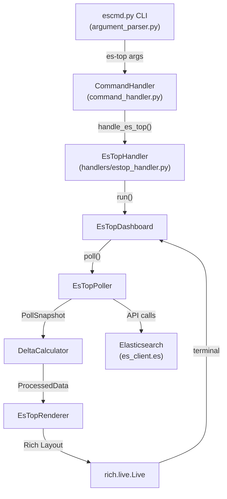

# Design Document: es-top

## Overview

`es-top` is a live, auto-refreshing terminal dashboard for Elasticsearch clusters, modeled after the Unix `top` command. It integrates into the existing `escmd.py` CLI as a registered command and uses `rich.live.Live` to render a full-screen, in-place-updating view of cluster health, node pressure, and index hot-spots.

The design follows the existing handler pattern: a thin `EsTopHandler` registered in `CommandHandler` delegates to a self-contained `EsTopDashboard` that owns the polling loop, state, and rendering lifecycle. The dashboard is decomposed into four focused components — `EsTopPoller`, `DeltaCalculator`, and `EsTopRenderer` — connected by two plain data structures: `PollSnapshot` and `ProcessedData`.

### Key Design Decisions

- **Separation of concerns**: Polling, delta math, and rendering are strictly separated so each can be tested independently.
- **No external state**: All session state (prior snapshot, session totals) lives in `DeltaCalculator` in memory. No files, no DB.
- **Timestamp-driven deltas**: Elapsed time is always derived from `PollSnapshot.timestamp`, never from the configured interval, so rate calculations are accurate even when polls are slow.
- **First-poll graceful degradation**: On the first poll there is no prior snapshot, so rate columns are hidden and a message is shown.
- **Reuse existing infrastructure**: `es_client.es` (raw Elasticsearch Python client), `ThemeManager`, `StyleSystem`, and `rich` are all reused directly.

---

## Architecture



### Data Flow

```
EsTopPoller
  → PollSnapshot (raw API responses + timestamp)
    → DeltaCalculator
      → ProcessedData (computed rates, session totals, styled values)
        → EsTopRenderer
          → Rich Layout (ClusterHeader panel + NodePanel table + IndexHotList table)
            → rich.live.Live (in-place terminal update)
```

---

## Components and Interfaces

### EsTopHandler

Entry point registered in `CommandHandler` under the key `"es-top"`. Follows the `BaseHandler` pattern exactly.

```python
# handlers/estop_handler.py
class EsTopHandler(BaseHandler):
    def handle_es_top(self) -> None:
        """Parse args, build EsTopDashboard, call run()."""
        interval = max(10, getattr(self.args, 'interval', 30))
        top_nodes = getattr(self.args, 'top_nodes', 5)
        top_indices = getattr(self.args, 'top_indices', 10)
        dashboard = EsTopDashboard(
            es_client=self.es_client,
            interval=interval,
            top_nodes=top_nodes,
            top_indices=top_indices,
            console=self.console,
        )
        dashboard.run()
```

Registration in `command_handler.py`:
```python
from handlers.estop_handler import EsTopHandler
# in __init__:
self.estop_handler = EsTopHandler(es_client, args, console, config_file, location_config, current_location, logger)
# in execute() command_handlers dict:
"es-top": self.estop_handler.handle_es_top,
```

---

### EsTopDashboard

Owns the `rich.live.Live` context and the main polling loop. Coordinates `EsTopPoller`, `DeltaCalculator`, and `EsTopRenderer`.

```python
class EsTopDashboard:
    def __init__(
        self,
        es_client,
        interval: int = 30,
        top_nodes: int = 5,
        top_indices: int = 10,
        console: Console = None,
    ) -> None: ...

    def run(self) -> None:
        """
        Enter rich.live.Live, run the poll loop until stop signal.
        Catches KeyboardInterrupt and 'q' keypress to exit cleanly.
        """

    def _poll_loop(self, live: Live) -> None:
        """
        Core loop: poll → calculate → render → sleep.
        If poll takes longer than interval, next sleep is 0.
        """

    def _stop(self) -> None:
        """Signal the loop to stop and restore terminal state."""
```

**Loop logic (pseudocode):**
```
while not stopped:
    cycle_start = time.monotonic()
    snapshot = poller.poll()
    processed = delta_calc.process(snapshot)
    layout = renderer.render(processed)
    live.update(layout)
    elapsed = time.monotonic() - cycle_start
    sleep_time = max(0, interval - elapsed)
    sleep(sleep_time)
```

---

### EsTopPoller

Issues the three required API calls and packages results into a `PollSnapshot`. All calls are sequential (lightweight mode deferred to Phase 2).

```python
class EsTopPoller:
    def __init__(self, es_client) -> None: ...

    def poll(self) -> PollSnapshot:
        """
        Issue _cluster/health, _nodes/stats, _cat/indices and return a PollSnapshot.
        Each call is wrapped in try/except; failures set the corresponding field to None
        and record the error message.
        """

    def _fetch_cluster_health(self) -> Optional[Dict]: ...
    def _fetch_nodes_stats(self) -> Optional[Dict]: ...
    def _fetch_cat_indices(self) -> Optional[List[Dict]]: ...
```

**API call details:**
- `es_client.es.cluster.health()` — returns cluster health dict
- `es_client.es.nodes.stats(metric='indices,os,jvm,fs')` — returns node stats dict
- `es_client.es.cat.indices(h='index,docs.count,search.query_total,store.size,pri,rep', format='json')` — returns list of index dicts

---

### DeltaCalculator

Pure computation component. Holds the prior `PollSnapshot` and the session totals map. No I/O.

```python
class DeltaCalculator:
    def __init__(self) -> None:
        self._prior: Optional[PollSnapshot] = None
        self._session_totals: Dict[str, SessionTotals] = {}  # index_name → SessionTotals
        self._poll_count: int = 0                            # incremented on each successful process() call

    def process(self, snapshot: PollSnapshot) -> ProcessedData:
        """
        Compute rates and session totals from snapshot vs prior.
        Replaces prior with snapshot after computation.
        Returns ProcessedData with is_first_poll=True if no prior exists.
        """

    def _compute_index_deltas(
        self,
        current: PollSnapshot,
        prior: PollSnapshot,
    ) -> Dict[str, IndexDelta]: ...

    def _elapsed_seconds(self, current: PollSnapshot, prior: PollSnapshot) -> float:
        """Returns (current.timestamp - prior.timestamp).total_seconds()"""

    def reset(self) -> None:
        """Clear prior snapshot, session totals, and poll counter (used on reconnect)."""
```

---

### EsTopRenderer

Converts `ProcessedData` into a Rich `Layout` (or `Group`) containing three sections. Uses `ThemeManager` / `StyleSystem` when available.

```python
class EsTopRenderer:
    def __init__(self, theme_manager=None) -> None:
        self.style_system = StyleSystem(theme_manager) if theme_manager else StyleSystem()

    def render(self, data: ProcessedData) -> RenderableType:
        """Build and return the full Rich renderable (Layout or Group)."""

    def _render_cluster_header(self, data: ProcessedData) -> Panel:
        """ClusterHeader panel: cluster name, status, node counts, shard counts."""

    def _render_node_panel(self, data: ProcessedData) -> Table:
        """NodePanel table: top N nodes by heap %, with threshold coloring."""

    def _render_index_hot_list(self, data: ProcessedData) -> Table:
        """IndexHotList table: top N indices by docs/sec (or totals on first poll)."""

    def _health_style(self, status: str) -> str:
        """Map 'green'→'green', 'yellow'→'yellow', 'red'→'red bold'."""

    def _heap_style(self, pct: float) -> str:
        """Return 'red bold' if pct >= 85, else default."""

    def _disk_style(self, pct: float) -> str:
        """Return 'red bold' if pct >= 90, 'yellow' if pct >= 85, else default."""
```

---

## Data Models

### PollSnapshot

Immutable record of one poll cycle's raw API responses.

```python
from dataclasses import dataclass, field
from datetime import datetime
from typing import Optional, Dict, List, Any

@dataclass(frozen=True)
class PollSnapshot:
    timestamp: datetime                          # wall-clock time of this poll
    cluster_health: Optional[Dict[str, Any]]     # _cluster/health response; None on failure
    nodes_stats: Optional[Dict[str, Any]]        # _nodes/stats response; None on failure
    cat_indices: Optional[List[Dict[str, Any]]]  # _cat/indices response; None on failure
    cluster_health_error: Optional[str] = None   # error message if cluster_health is None
    nodes_stats_error: Optional[str] = None      # error message if nodes_stats is None
    cat_indices_error: Optional[str] = None      # error message if cat_indices is None
```

### SessionTotals

Per-index cumulative counters accumulated across all poll cycles.

```python
@dataclass
class SessionTotals:
    docs_written: int = 0      # sum of per-cycle docs.count deltas
    searches_executed: int = 0  # sum of per-cycle search.query_total deltas
```

### IndexDelta

Per-index computed values for one poll cycle.

```python
@dataclass
class IndexDelta:
    index_name: str
    docs_per_sec: float          # (current_docs - prior_docs) / elapsed_seconds
    searches_per_sec: float      # (current_searches - prior_searches) / elapsed_seconds
    session_docs: int            # cumulative docs written this session
    session_searches: int        # cumulative searches this session
    total_docs: int              # current total doc count
    store_size: str              # human-readable store size from _cat/indices
```

### NodeStat

Per-node extracted and styled values.

```python
@dataclass
class NodeStat:
    name: str
    heap_pct: float       # JVM heap used %
    cpu_pct: float        # OS CPU %
    load_1m: float        # 1-minute load average
    disk_used_pct: float  # disk used %
    disk_free_bytes: int  # disk available bytes
```

### ProcessedData

The complete output of `DeltaCalculator.process()`, consumed by `EsTopRenderer`.

```python
@dataclass
class ProcessedData:
    snapshot: PollSnapshot           # the current snapshot (for error banners)
    is_first_poll: bool              # True if no prior snapshot existed
    elapsed_since_poll: float        # seconds since this snapshot's timestamp (for header)
    interval: int                    # configured refresh interval (for header)

    # Poll tracking
    poll_count: int                  # number of successful polls since EsTop started (1-based)
    last_poll_time: datetime         # wall-clock time of the current snapshot (for header display)

    # Cluster header data
    cluster_name: str
    cluster_status: str              # 'green' | 'yellow' | 'red'
    total_nodes: int
    data_nodes: int
    active_shards: int
    relocating_shards: int
    initializing_shards: int
    unassigned_shards: int

    # Node panel data (pre-sorted, top N)
    top_nodes: List[NodeStat]

    # Index hot list data (pre-sorted, top N, only active indices)
    top_indices: List[IndexDelta]

    # Error states (None = no error)
    cluster_health_error: Optional[str]
    nodes_stats_error: Optional[str]
    cat_indices_error: Optional[str]
```

---

## Correctness Properties

*A property is a characteristic or behavior that should hold true across all valid executions of a system — essentially, a formal statement about what the system should do. Properties serve as the bridge between human-readable specifications and machine-verifiable correctness guarantees.*

### Property 1: Interval validation clamps to minimum

*For any* integer input to the `--interval` argument, the effective interval used by `EsTopDashboard` SHALL be `max(10, input_value)`. Values below 10 are clamped to 10; values at or above 10 are used as-is.

**Validates: Requirements 1.1**

---

### Property 2: Rate computation formula

*For any* valid pair of successive `PollSnapshot` values where both have non-None `cat_indices` data, the `docs_per_sec` computed by `DeltaCalculator` for each index SHALL equal `(current_docs_count - prior_docs_count) / (current_timestamp - prior_timestamp).total_seconds()`, and `searches_per_sec` SHALL equal `(current_search_total - prior_search_total) / elapsed_seconds`. The elapsed time is always derived from the snapshot timestamps, never from the configured interval.

**Validates: Requirements 5.1, 5.2, 8.2, 8.6**

---

### Property 3: Session total accumulation invariant

*For any* sequence of N poll cycles (N ≥ 2) for a given index, the `session_docs` in the final `ProcessedData` SHALL equal the sum of all per-cycle `docs_per_sec * elapsed_seconds` deltas across all cycles, and `session_searches` SHALL equal the sum of all per-cycle search deltas. Session totals are monotonically non-decreasing.

**Validates: Requirements 5.3, 8.3**

---

### Property 4: Single prior snapshot invariant

*For any* sequence of poll cycles, after processing N snapshots, `DeltaCalculator` SHALL retain exactly one prior snapshot in memory — the most recently processed one. Processing a new snapshot always replaces the prior, never accumulates multiple priors.

**Validates: Requirements 8.1**

---

### Property 5: Disappeared index retains session total

*For any* pair of successive snapshots where an index present in the prior snapshot is absent from the current snapshot, `DeltaCalculator` SHALL omit that index from the current cycle's `top_indices` rate output but SHALL retain its `SessionTotals` entry in the session map with its accumulated values unchanged.

**Validates: Requirements 8.4**

---

### Property 6: New index initializes to zero rates

*For any* pair of successive snapshots where an index is present in the current snapshot but absent from the prior snapshot, `DeltaCalculator` SHALL report `docs_per_sec = 0` and `searches_per_sec = 0` for that index in the current cycle, and SHALL initialize its `SessionTotals` to zero.

**Validates: Requirements 8.5**

---

### Property 7: Node panel threshold styling

*For any* `NodeStat` with a given `heap_pct`, the rendered heap cell style SHALL be `'red bold'` when `heap_pct >= 85` and the default style otherwise. For `disk_used_pct`, the rendered disk cell style SHALL be `'red bold'` when `disk_used_pct >= 90`, `'yellow'` when `85 <= disk_used_pct < 90`, and the default style otherwise.

**Validates: Requirements 4.3, 4.4**

---

### Property 8: Cluster header completeness

*For any* `ProcessedData` with a non-None `cluster_health`, the rendered `ClusterHeader` panel SHALL contain the cluster name, health status, total node count, data node count, active shard count, relocating shard count, initializing shard count, unassigned shard count, poll counter, and last-polled timestamp.

**Validates: Requirements 3.1, 3.2, 1.7, 1.8**

---

### Property 9: Unassigned shard red styling

*For any* `ProcessedData` where `unassigned_shards > 0`, the rendered `ClusterHeader` SHALL include the unassigned shard count rendered with red styling. When `unassigned_shards == 0`, no red styling is applied to the unassigned count.

**Validates: Requirements 3.3**

---

### Property 10: Index hot list completeness and cap

*For any* `ProcessedData` with `is_first_poll = False` and a non-None `cat_indices`, the rendered `IndexHotList` SHALL contain only indices that had at least one doc written or search executed during the session, the count of displayed indices SHALL be at most `top_indices` (the configured N), and each displayed row SHALL contain: index name, docs/sec, searches/sec, session total docs, session total searches, total doc count, and store size.

**Validates: Requirements 5.4, 5.5**

---

### Property 11: Next-cycle scheduling after slow poll

*For any* poll cycle duration `d` and configured interval `i`, the sleep time before the next cycle SHALL be `max(0, i - d)`. When `d >= i`, the sleep time is 0 (next cycle starts immediately, never negative).

**Validates: Requirements 1.5**

---

### Property 12: Poll counter monotonicity

*For any* sequence of N calls to `DeltaCalculator.process()`, the `poll_count` in the returned `ProcessedData` SHALL equal N (1-based, incrementing by exactly 1 per call). After `reset()`, the counter restarts at 0 and the next `process()` call returns `poll_count = 1`.

**Validates: Requirements 1.8**

---

## Error Handling

Each of the three API calls in `EsTopPoller` is independently wrapped in `try/except`. A failure in one call does not prevent the others from running. The resulting `PollSnapshot` carries `None` for the failed field and the error message string.

`EsTopRenderer` checks each error field in `ProcessedData`:
- `cluster_health_error` → red error banner at the top of the ClusterHeader panel; last successful values are shown below it (retained in `DeltaCalculator` from the prior `ProcessedData`).
- `nodes_stats_error` → yellow warning banner in the NodePanel; last node data is shown.
- `cat_indices_error` → yellow warning banner in the IndexHotList; last computed rates and session totals are shown.

`EsTopDashboard` catches `KeyboardInterrupt` and a `q` keypress (via a non-blocking stdin check or `rich.live`'s keyboard handling) to exit the loop cleanly. The `rich.live.Live` context manager ensures the terminal is restored on exit regardless of how the loop ends.

Connection errors during polling are treated the same as API call failures — the error is surfaced in the relevant panel and the dashboard continues running.

---

## Testing Strategy

### Unit Tests

Unit tests cover specific examples, edge cases, and error conditions:

- `EsTopHandler`: verify `handle_es_top` clamps interval to 10, passes correct args to `EsTopDashboard`.
- `EsTopPoller`: mock `es_client.es`; verify `poll()` returns a `PollSnapshot` with all fields populated; verify individual API failures set the corresponding field to `None` and populate the error field.
- `DeltaCalculator`: verify first-poll returns `is_first_poll=True`; verify disappeared index retains session total; verify new index initializes to zero; verify `reset()` clears state.
- `EsTopRenderer`: verify first-poll rendering omits rate columns and shows "rates available after next poll" message; verify health status color mapping (green/yellow/red); verify error banners appear when error fields are set.
- Command registration: verify `'es-top'` key exists in `CommandHandler.execute()`'s `command_handlers` dict.

### Property-Based Tests

Property-based tests use [Hypothesis](https://hypothesis.readthedocs.io/) (Python PBT library). Each test runs a minimum of 100 iterations.

**Configuration:**
```python
from hypothesis import given, settings
from hypothesis import strategies as st

@settings(max_examples=100)
@given(...)
def test_property_N_description(...):
    # Feature: es-top, Property N: <property text>
    ...
```

**Property test implementations:**

- **Property 1** — `@given(st.integers())`: construct handler with input interval; verify `max(10, input)` is used.
- **Property 2** — `@given(st.lists(st.fixed_dictionaries({...}), min_size=1), st.datetimes(), st.timedeltas(min_value=timedelta(seconds=1)))`: build two `PollSnapshot` values with generated doc/search counts and timestamps; call `DeltaCalculator.process()` twice; verify formula holds for each index.
- **Property 3** — `@given(st.lists(st.integers(min_value=0), min_size=2))`: simulate N poll cycles with generated doc count sequences; verify session total equals sum of deltas.
- **Property 4** — `@given(st.lists(st.builds(PollSnapshot, ...), min_size=1))`: process N snapshots; verify `_prior` is always the last one processed.
- **Property 5** — `@given(...)`: build prior snapshot with index set A, current snapshot with index set B ⊂ A; verify missing indices absent from rates but present in session map.
- **Property 6** — `@given(...)`: build prior snapshot with index set A, current snapshot with index set A ∪ {new_index}; verify new index has zero rates.
- **Property 7** — `@given(st.floats(min_value=0, max_value=100))`: call `_heap_style(pct)` and `_disk_style(pct)`; verify correct style returned at each threshold.
- **Property 8** — `@given(st.fixed_dictionaries({cluster_name: st.text(), status: st.sampled_from(['green','yellow','red']), ...}))`: build `ProcessedData` with generated cluster health; render ClusterHeader; verify all required fields present in output string.
- **Property 9** — `@given(st.integers(min_value=0, max_value=10000))`: build `ProcessedData` with generated `unassigned_shards`; render ClusterHeader; verify red styling present iff `unassigned_shards > 0`.
- **Property 10** — `@given(st.lists(st.builds(IndexDelta, ...), min_size=0, max_size=50), st.integers(min_value=1, max_value=20))`: build `ProcessedData` with generated index deltas and top_indices N; render IndexHotList; verify count ≤ N, only active indices shown, all required fields present.
- **Property 11** — `@given(st.floats(min_value=0, max_value=120), st.integers(min_value=10, max_value=120))`: compute `max(0, interval - poll_duration)`; verify result is always ≥ 0 and equals expected formula.
