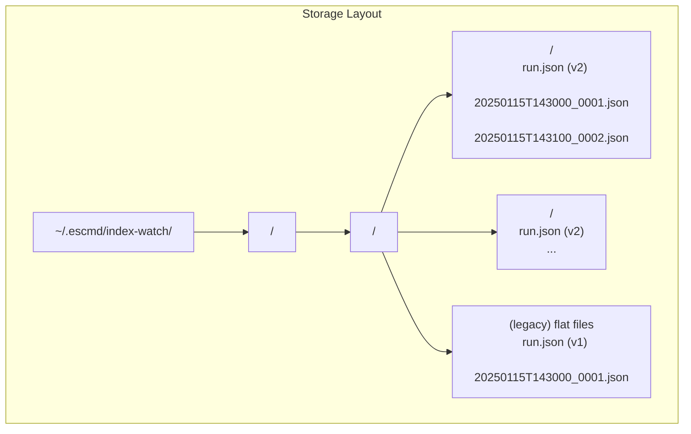

# Design Document: indices-watch-collect-sessions

## Overview

This feature adds a **session layer** to the index-watch collection system. Currently all runs on the same day for the same cluster land in a single `<YYYY-MM-DD>` directory, mixing data from unrelated collection windows. The session layer introduces a subdirectory per run (`<YYYY-MM-DD>/<session_id>/`), an interactive picker at startup, and new CLI flags to control session selection. The same logic applies to the `es-top --collect` path.

The design is additive: `default_run_dir()` is unchanged, all new session resolution flows through a new `resolve_session_dir()` function, and legacy flat date directories continue to work.

---

## Architecture

```mermaid
flowchart TD
    A[CLI: indices-watch-collect / es-top --collect] --> B{--output-dir / --collect-dir given?}
    B -- yes --> C[Write directly to explicit path\n(no session logic)]
    B -- no --> D[resolve_session_dir()]
    D --> E{--new-session flag?}
    E -- yes --> F[Create fresh Session_Directory]
    E -- no --> G{--join-latest flag?}
    G -- yes --> H[list_sessions() → pick latest]
    G -- no --> I[list_sessions()]
    I --> J{Sessions found?}
    J -- none --> F
    J -- legacy flat files only --> K[Session_Picker: legacy option + new]
    J -- sessions exist --> L{stdin is TTY?}
    L -- yes --> M[Session_Picker: interactive prompt]
    L -- no --> N[Auto-select latest, log notice]
    M --> O{User choice}
    O -- join existing --> P[Use existing Session_Directory]
    O -- new session --> F
    K --> O
    H --> P
    N --> P
    F --> Q[write_run_metadata v2]
    P --> R[Append samples, preserve run.json]
    Q --> S[save_sample_file loop]
    R --> S
```



---

## Components and Interfaces

### 1. `processors/indices_watch.py` — new and modified functions

#### `sanitize_session_label(label: str) -> str`
Replaces any character not in `[a-zA-Z0-9_-]` with `_`, then truncates to 40 characters.

```python
def sanitize_session_label(label: str) -> str: ...
```

#### `make_session_id(dt: datetime, label: Optional[str] = None) -> str`
Derives a session ID from a UTC datetime. Format: `HHMM` or `HHMM-<sanitized_label>`.

```python
def make_session_id(dt: datetime, label: Optional[str] = None) -> str: ...
```

#### `resolve_session_dir(cluster_slug: str, day_iso: str, *, label: Optional[str] = None, dt: Optional[datetime] = None) -> Path`
Computes a non-conflicting session directory path under `default_run_dir(cluster_slug, day_iso)`. Appends `-2`, `-3`, … if the computed path already exists. Does **not** create the directory.

```python
def resolve_session_dir(
    cluster_slug: str,
    day_iso: str,
    *,
    label: Optional[str] = None,
    dt: Optional[datetime] = None,
) -> Path: ...
```

#### `SessionInfo` (dataclass)
Lightweight descriptor returned by `list_sessions()`.

```python
@dataclass
class SessionInfo:
    session_id: str
    session_dir: Path
    started_at: str          # ISO-8601 from run.json
    label: Optional[str]
    sample_count: int        # number of non-run.json .json files
    schema_version: int
```

#### `list_sessions(date_dir: Path) -> List[SessionInfo]`
Scans `date_dir` for subdirectories containing a `run.json` with `schema_version == 2`. Returns results sorted ascending by `started_at`. Ignores subdirectories without a parseable `run.json` or with `schema_version != 2`.

```python
def list_sessions(date_dir: Path) -> List[SessionInfo]: ...
```

#### `is_legacy_date_dir(date_dir: Path) -> bool`
Returns `True` if `date_dir` contains flat `.json` sample files (not inside subdirectories) but no valid session subdirectories.

```python
def is_legacy_date_dir(date_dir: Path) -> bool: ...
```

#### `write_run_metadata` — updated signature
Adds `session_id` and `label` parameters; writes `schema_version: 2` when they are provided. Existing callers that omit the new kwargs continue to write `schema_version: 1`.

```python
def write_run_metadata(
    out_dir: Path,
    *,
    cluster: str,
    interval_seconds: int,
    duration_seconds: Optional[int],
    pattern: Optional[str],
    status: Optional[str],
    session_id: Optional[str] = None,   # NEW
    label: Optional[str] = None,        # NEW
) -> None: ...
```

#### `pick_or_create_session_dir(cluster_slug, day_iso, *, new_session, join_latest, label, console, is_tty) -> Tuple[Path, bool]`
Central session-resolution helper used by both `handle_indices_watch_collect()` and `EsTopDashboard.__init__()`. Returns `(session_dir, is_new)`. Encapsulates all picker/flag logic so neither caller duplicates it.

```python
def pick_or_create_session_dir(
    cluster_slug: str,
    day_iso: str,
    *,
    new_session: bool = False,
    join_latest: bool = False,
    label: Optional[str] = None,
    console: Any = None,
    is_tty: bool = True,
) -> Tuple[Path, bool]: ...
```

Internal logic:
1. If `new_session` → `resolve_session_dir(...)`, return `(path, True)`.
2. Build `date_dir = default_run_dir(cluster_slug, day_iso)`.
3. `sessions = list_sessions(date_dir)`.
4. If `join_latest` and sessions → return `(sessions[-1].session_dir, False)`.
5. If `join_latest` and no sessions → `resolve_session_dir(...)`, return `(path, True)`.
6. If no sessions and not legacy → `resolve_session_dir(...)`, return `(path, True)`.
7. If legacy flat dir → show picker with legacy option (or auto-new if not TTY).
8. If sessions exist and not TTY → auto-select `sessions[-1]`, log notice, return `(sessions[-1].session_dir, False)`.
9. If sessions exist and TTY → show `Session_Picker`, return based on user choice.

#### `format_session_list(sessions: List[SessionInfo]) -> str`
Renders a numbered list of sessions for display in the picker and `--list-sessions` output. Each line includes: number, session_id, start time, sample count, label (or `—`).

```python
def format_session_list(sessions: List[SessionInfo]) -> str: ...
```

#### `run_indices_watch_report` — updated
Handles new `--session` and `--list-sessions` args before the existing sample-loading logic. See section below.

---

### 2. `handlers/index_handler.py` — `handle_indices_watch_collect()`

Replace the current `default_run_dir` + `write_run_metadata` block with a call to `pick_or_create_session_dir()`. New args read from `self.args`:

| Arg attr | Source flag |
|---|---|
| `new_session` | `--new-session` |
| `join_latest` | `--join-latest` |
| `label` | `--label` |

When `is_new` is `True`, call `write_run_metadata(..., session_id=..., label=...)` (v2). When `is_new` is `False` (joining), skip `write_run_metadata` entirely.

---

### 3. `commands/estop_commands.py` — `EsTopDashboard.__init__()`

Add `new_session`, `join_latest`, `label` constructor parameters. Replace the `default_run_dir` block with `pick_or_create_session_dir()` when `collect=True` and `collect_dir` is `None`. When `collect_dir` is given, keep the existing direct-path behavior.

---

### 4. `cli/argument_parser.py` — new arguments

#### `indices-watch-collect` parser additions

```
--new-session          Skip picker; always create a fresh session directory
--join-latest          Skip picker; join the most recently started session (or create new)
--label LABEL          Human-readable label appended to the session ID (e.g. "load-test")
```

#### `indices-watch-report` parser additions

```
--session SESSION_ID   Load from the named session under the resolved date directory
--list-sessions        Print available sessions and exit (no report generated)
```

#### `es-top` / `top` parser additions

```
--new-session          (same semantics as indices-watch-collect; no effect without --collect)
--join-latest          (same semantics; no effect without --collect)
--label LABEL          (same semantics; no effect without --collect)
```

---

## Data Models

### Session Directory Layout

```
~/.escmd/index-watch/
  <cluster>/
    <YYYY-MM-DD>/
      <session_id>/          ← Session_Directory
        run.json             ← schema_version: 2
        20250115T143000_0001.json
        20250115T143100_0002.json
        ...
      <session_id-2>/
        run.json
        ...
      (legacy: flat files directly in <YYYY-MM-DD>/)
```

### `run.json` schema version 2

```json
{
  "kind": "indices-watch-run",
  "schema_version": 2,
  "cluster": "prod-us-east",
  "session_id": "1430-load-test",
  "label": "load-test",
  "started_at": "2025-01-15T14:30:00+00:00",
  "interval_seconds": 60,
  "duration_seconds": null,
  "pattern": "logs-*",
  "status": null
}
```

### `run.json` schema version 1 (legacy, unchanged)

```json
{
  "kind": "indices-watch-run",
  "schema_version": 1,
  "cluster": "prod-us-east",
  "started_at": "2025-01-15T14:30:00+00:00",
  "interval_seconds": 60,
  "duration_seconds": null,
  "pattern": null,
  "status": null
}
```

### Session_ID format

| Scenario | Example |
|---|---|
| No label | `1430` |
| With label | `1430-load-test` |
| Collision on `1430` | `1430-2` |
| Collision on `1430-load-test` | `1430-load-test-2` |

### Label sanitization rules

- Replace `[^a-zA-Z0-9_-]` → `_`
- Truncate to 40 characters
- Examples: `"load test"` → `"load_test"`, `"my/test!"` → `"my_test_"`, `"a" * 50` → `"a" * 40`

---

## Correctness Properties

*A property is a characteristic or behavior that should hold true across all valid executions of a system — essentially, a formal statement about what the system should do. Properties serve as the bridge between human-readable specifications and machine-verifiable correctness guarantees.*

### Property 1: Session path structure

*For any* cluster slug, UTC date string, and session ID, `resolve_session_dir` SHALL return a path whose components are `<Base_Dir>/<sanitized_cluster>/<date>/<session_id>`.

**Validates: Requirements 1.1**

---

### Property 2: Session ID derivation with optional label

*For any* UTC datetime and optional label string, `make_session_id(dt, label)` SHALL return a string that starts with the zero-padded 4-digit `HHMM` of `dt`, and when a non-empty label is provided, the string SHALL be `HHMM-<sanitize_session_label(label)>`.

**Validates: Requirements 1.2, 1.3**

---

### Property 3: Label sanitization

*For any* input string `s`, `sanitize_session_label(s)` SHALL return a string of length at most 40 whose every character is in `[a-zA-Z0-9_-]`.

**Validates: Requirements 1.4**

---

### Property 4: Session ID collision avoidance

*For any* set of pre-existing session directory names under a date directory, `resolve_session_dir` SHALL return a path whose final component does not match any name in that set.

**Validates: Requirements 1.5**

---

### Property 5: Session listing display completeness

*For any* non-empty list of `SessionInfo` objects, `format_session_list` SHALL return a string that contains each session's `session_id`, `started_at`, `sample_count`, and `label` (or a placeholder when label is absent).

**Validates: Requirements 2.2, 5.8, 6.2**

---

### Property 6: Most-recent session selection

*For any* non-empty list of `SessionInfo` objects with distinct `started_at` values, `list_sessions` SHALL return them in ascending `started_at` order, so that `sessions[-1]` is always the most recently started session.

**Validates: Requirements 2.7, 5.3, 6.2**

---

### Property 7: run.json v2 field completeness

*For any* valid combination of `cluster`, `session_id`, `label`, `interval_seconds`, `duration_seconds`, and `pattern`, `write_run_metadata` with `session_id` provided SHALL write a `run.json` containing all required v2 fields (`kind`, `schema_version=2`, `cluster`, `session_id`, `label`, `started_at`, `interval_seconds`, `duration_seconds`, `pattern`).

**Validates: Requirements 3.1, 3.3**

---

### Property 8: Join session preserves run.json

*For any* existing `run.json` content in a session directory, calling `pick_or_create_session_dir` with `join_latest=True` (or selecting an existing session via the picker) SHALL leave the `run.json` byte-for-byte identical after the operation.

**Validates: Requirements 3.2**

---

### Property 9: Session registry filtering and ordering

*For any* directory structure containing a mix of valid session subdirectories (with `schema_version=2` `run.json`), invalid subdirectories (missing or unparseable `run.json`), and legacy flat files, `list_sessions` SHALL return only the valid session subdirectories, sorted ascending by `started_at`.

**Validates: Requirements 6.1, 6.2, 6.3, 6.4**

---

### Property 10: `default_run_dir` unchanged

*For any* cluster slug and date string, `default_run_dir(cluster_slug, day_iso)` SHALL return `<Base_Dir>/<sanitized_cluster>/<day_iso>` with no session subdirectory component, identical to its pre-feature behavior.

**Validates: Requirements 7.3**

---

### Property 11: Legacy v1 run.json backward compatibility

*For any* `run.json` file with `schema_version=1`, the report reader SHALL parse it without raising an exception and SHALL produce a valid report result (or a graceful "not enough samples" message).

**Validates: Requirements 7.4**

---

### Property 12: Legacy flat directory load compatibility

*For any* legacy date directory containing flat `.json` sample files (no session subdirectories), `load_samples` called on that directory SHALL return the same samples as it did before this feature was introduced.

**Validates: Requirements 5.5, 7.1**

---

## Error Handling

| Scenario | Behavior |
|---|---|
| `--session <id>` not found | Print error listing available sessions; exit non-zero |
| `run.json` in a subdir is invalid JSON | `list_sessions` silently skips that subdir |
| `run.json` missing `schema_version` | Treated as legacy (v1); not included in session registry |
| Date directory does not exist | `list_sessions` returns `[]`; new session created |
| Non-TTY environment with sessions present | Auto-select latest session; print notice to stderr |
| Non-TTY environment, no sessions | Create new session silently |
| Label contains only invalid characters | Sanitized to all underscores; still appended |
| Label sanitizes to empty string | Session ID is just `HHMM` (label omitted) |
| Session directory creation fails (permissions) | Propagate `OSError` to caller with context |
| `--new-session` and `--join-latest` both set | `--new-session` takes precedence |

---

## Testing Strategy

This feature uses a **dual testing approach**: example-based unit tests for specific behaviors and property-based tests for universal invariants.

### Property-Based Testing

Library: **Hypothesis** (already present in the project via `.hypothesis/` directory).

Each property test runs a minimum of 100 iterations. Tests are tagged with a comment referencing the design property.

```python
# Feature: indices-watch-collect-sessions, Property 3: Label sanitization
@given(st.text())
@settings(max_examples=200)
def test_sanitize_session_label(label):
    result = sanitize_session_label(label)
    assert len(result) <= 40
    assert re.fullmatch(r'[a-zA-Z0-9_\-]*', result)
```

Properties 1–12 each map to one property-based test in `tests/test_indices_watch_sessions.py`.

### Unit / Example-Based Tests

- Session picker display with 0, 1, and N sessions
- `--new-session` bypasses picker
- `--join-latest` with and without existing sessions
- `--output-dir` / `--collect-dir` bypasses session logic entirely
- Non-TTY auto-selection with stderr notice
- `--session <id>` happy path and not-found error path
- `--list-sessions` output and exit
- `write_run_metadata` v1 (no session_id) vs v2 (with session_id)
- `EsTopDashboard` with `collect=True`, `collect_dir=None` calls `pick_or_create_session_dir`
- `EsTopDashboard` with `collect=True`, `collect_dir=<path>` uses direct path

### Integration / Regression Tests

- Full collect → report round-trip with a session directory
- Legacy flat directory: collect appends to date dir, report reads correctly
- Mixed directory (sessions + legacy flat files): picker shows both options
- `--list-sessions` on a date dir with multiple sessions

### What PBT Does Not Cover

- Interactive picker UI rendering (tested via unit tests with captured output)
- CLI argument parsing (tested via `argparse` unit tests)
- File I/O side effects like `mkdir` (tested via example-based tests with `tmp_path`)
